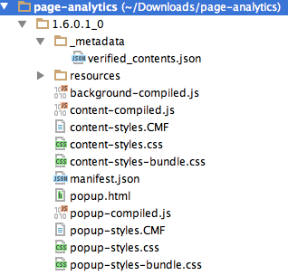
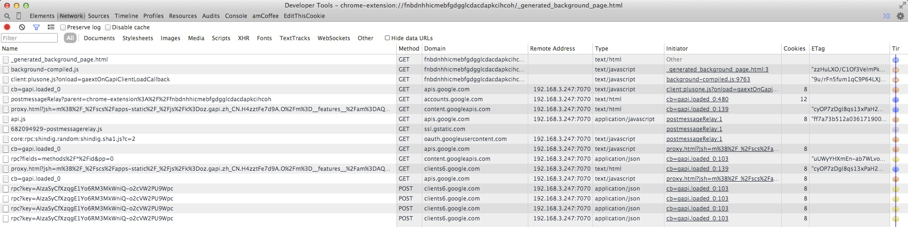
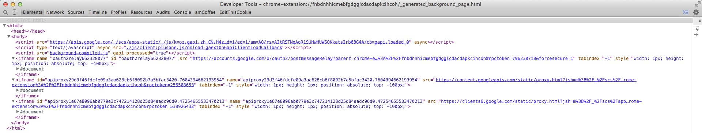
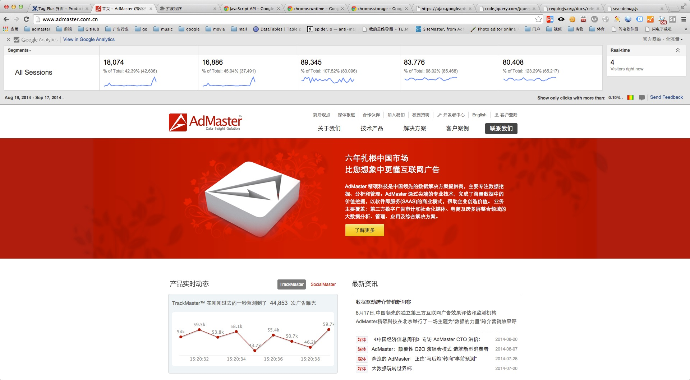
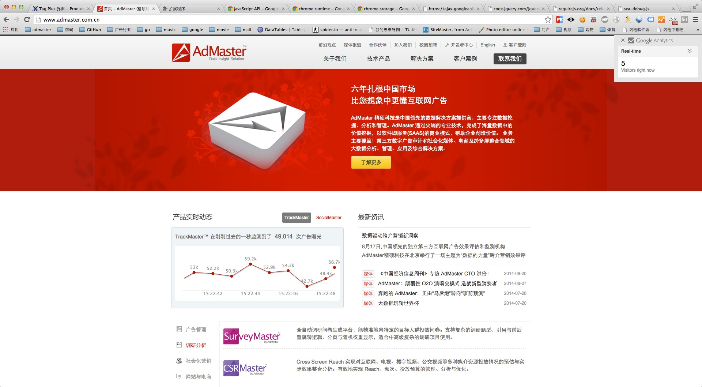
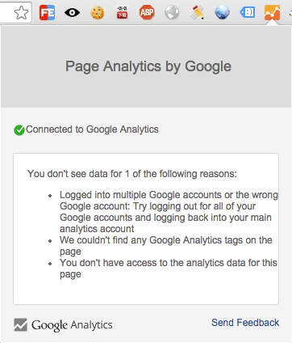
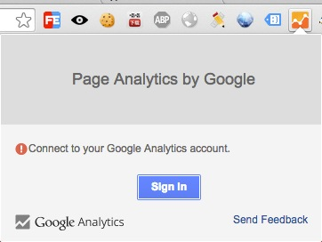
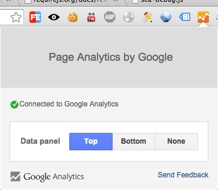

网站分析——浏览器工具
==========================

调研
---------------

- [Page Analytics (by Google)](https://chrome.google.com/webstore/detail/page-analytics-by-google/fnbdnhhicmebfgdgglcdacdapkcihcoh?hl=en)，一款用于查看用户与你的网页互动的 Chrome 扩展。

- [Tag Assistant (by Google)](https://chrome.google.com/webstore/detail/tag-assistant-by-google/kejbdjndbnbjgmefkgdddjlbokphdefk?utm_source=chrome-ntp-icon)，效率型的小助理，用于验证谷歌追踪码的安装状态，包括Google Analytics, Adwords Conversion Tracking, Google Tag Manager 等。

- [Google Analytics Debugger](https://chrome.google.com/webstore/detail/google-analytics-debugger/jnkmfdileelhofjcijamephohjechhna?utm_source=chrome-ntp-icon)，主要是用來除错，在一些定制化的JavaScript处理上，可以用来检查 Google Analytics 数据是否成功发送。

Chrome扩展开发案例——Page Analtics（by Google）代码逆向分析
---------------

### 目录结构

主要由manifest.json、background.js、content.js（css）、popup.js(html、css)和resources（主要存放图片资源）五部分组成。代码分析见page-analytics/1.6.0.1_0/

 

_metadata目录是将扩展上传到Chrome web store时，由Google添加进crx中的验证文件。

注释：CMF文件暂时未知用途。

### 文件功能

#### manifest.json：
Chrome Extensions配置清单文件。用于配置加载background、content_scripts、popup等。

#### background：
后台网页。有三个作用：

1. 用于验证Google+ 登录API，并在加载完 client:plusone.js（https://apis.google.com/js/client:plusone.js?onload=gaextOnGapiClientLoadCallback） 时调用回调方法 gaextOnGapiClientLoadCallback。

2. 读写storage存储。websiteSettings（Config）、ga-clientId(GAClient)

3. 读写cookie。APISID、SAPISID(Background的Auth)

##### 网络视图

 

##### background Elements视图

 

##### client:plusone 

 

#### content_script：
根据登录和popup中的 Data Panel 位置信息，在页面中创建 Data Panel

Data Panel:
 

Real-time:
 

#### popup：
根据登录信息，呈现未显示 Data Panel 原因、登录或控制 Data Panel 位置信息

未显示 Data Panel 原因:

 

登录:

 

设置 Data Panel 位置:

 

参考
---------------

- [網站分析師瀏覽器必掛工具 – Tag Assistant (by Google)](http://blog.wis.com.tw/2013/fay/tag-assistant-by-google/) 

- [Building a Chrome Extension with Yeoman](http://www.alolo.co/blog/2013/10/30/building-a-chrome-extension-with-yeoman)

- [Chrome Extension generator](https://github.com/yeoman/generator-chrome-extension)

- [Chrome 官网扩展程序文档](https://developer.chrome.com/extensions/extension)

- [Chrome 扩展程序、应用开发文档（非官方中文版）](https://code.google.com/p/crxdoczh/)

- [360极速浏览器应用开放平台](http://open.chrome.360.cn/extension_dev/overview.html)

- [Google+ Platform JavaScript API](https://developers.google.com/+/web/api/javascript?hl=zh-cn)

